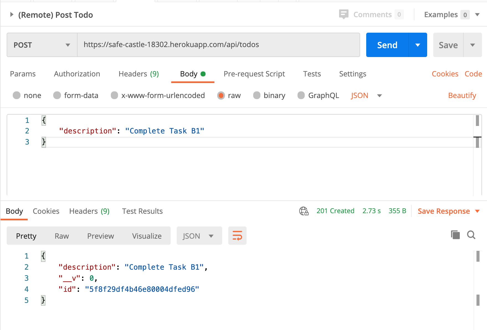
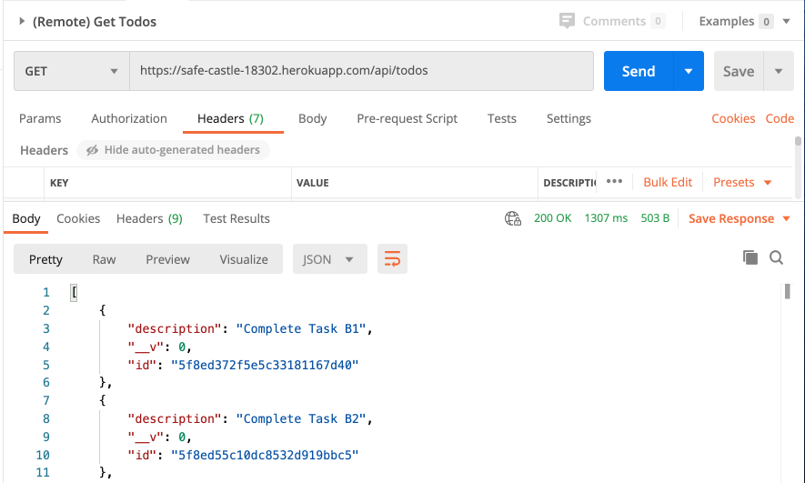
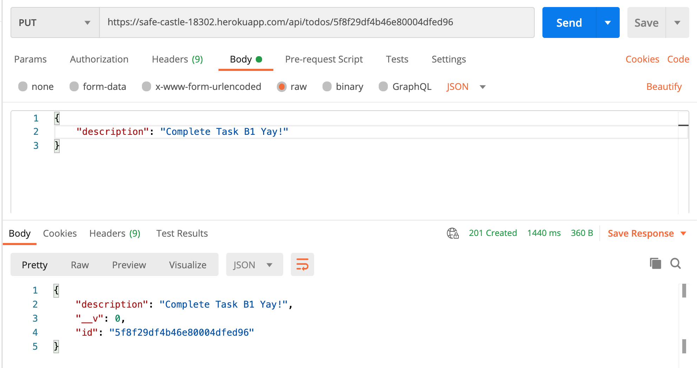
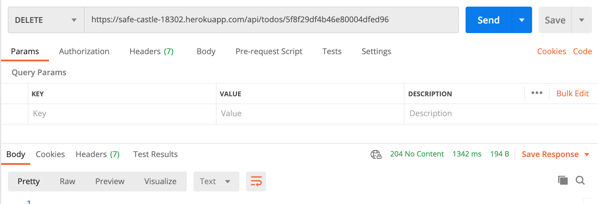
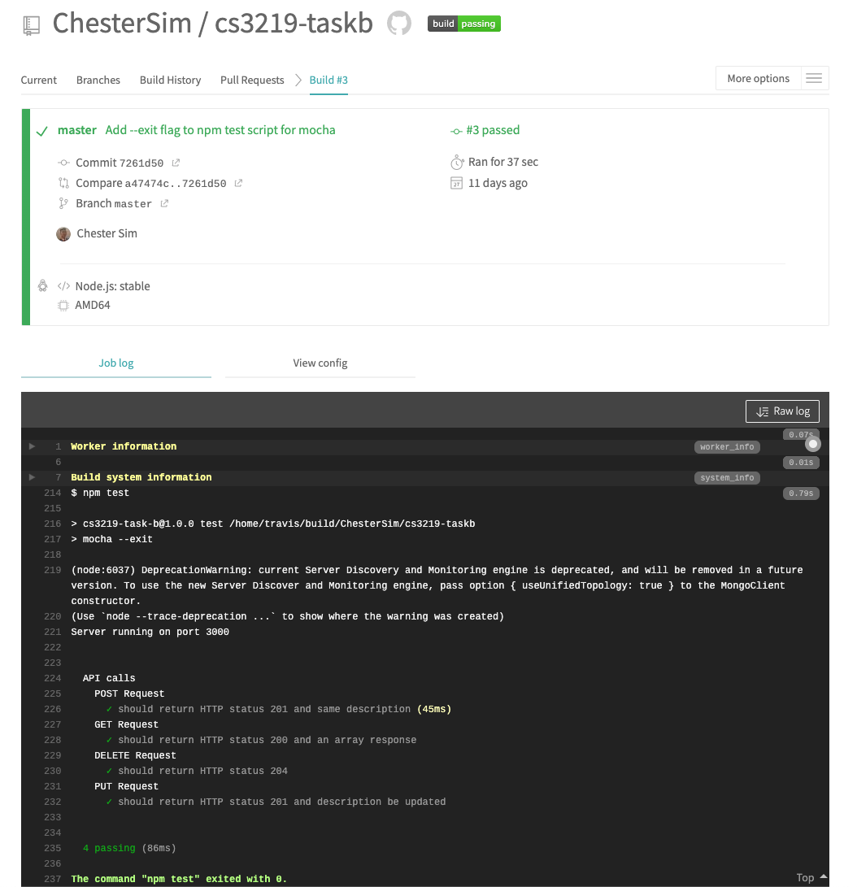
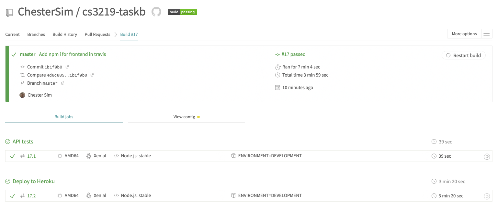
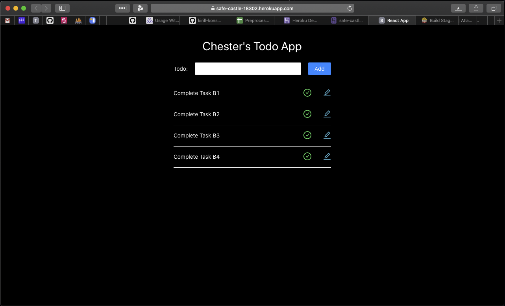

# Task B

Name: Chester Sim

Student ID: A0185095W

Github Repo: [https://github.com/ChesterSim/cs3219-taskb](https://github.com/ChesterSim/cs3219-taskb)

# Introduction

This app is a todo app based on NodeJS, React, deployed on Heroku, and tested on Mocha + Chai.

# Task B1

1. Clone the repo

```bash
git clone git@github.com:ChesterSim/cs3219-taskb.git
```

2. Ensure that you have installed MongoDB on your computer, if not you can check out this link: [https://docs.mongodb.com/manual/installation/](https://docs.mongodb.com/manual/installation/)

3. Install node dependencies and run the server

```bash
npm i && npm start
```

4. Use  the Postman Collection to send API calls to both local and remote server. You can find the Postman Collection file in the root folder called `CS3219-Task-B.postman_collection.json`.

### Steps to use Postman Collection (both local and remote APIs)

1. Let's add a todo first. Head over to the Post Todo API, and write a description of your task in the body of the request. Press send, and we should be expecting a result that replicates the data you just sent! Now, take note of the id of the response.

    

2. Next, we get all the Todos in the database. We can just send the Get Todos API without doing anything. We should expect a response of all the todos in the database.

    

3. Next, lets try to update one of the todos. Remember the id when we first added a todo? Now, we will concatenate that id to the back of the Put Todo API's URL. Then we can write the new description in the body of the request. Press send, and we should expect a response that replicates the new description!

    

4. Lastly, we will delete this todo. Head over to the Delete Todo API, and again concatenate that same id to the back of the URL. Press send, and the only thing we should expect is the HTTP response status of 204.

    

# Task B2

## Part A

Run test script locally using the following command.

```bash
npm test
```

## Part B

The command to test the API is as such in `travis.yml`

```bash
jobs:
  include:
    - stage: "API tests"
      script: npm run test
```

Check the Travis CI build result in this link: [https://travis-ci.org/github/ChesterSim/cs3219-taskb/builds/728613455](https://travis-ci.org/github/ChesterSim/cs3219-taskb/builds/728613455)



# Task B3

The Web App is currently deployed on Heroku. We integrate the stage of deployment to Heroku into our Continuous Deployment flow by placing it as a job in the `travis.yml` file as such:

```java
deploy:
  provider: heroku
  api_key:
		secure: MY_API_KEY
  app: safe-castle-18302
  on:
    repo: ChesterSim/cs3219-taskb
  skip_cleanup: true
```

You can check out the Travis build that includes both testing and deployment in this link: [https://travis-ci.org/github/ChesterSim/cs3219-taskb/builds/737496665](https://travis-ci.org/github/ChesterSim/cs3219-taskb/builds/737496665)



# Task B4

For the frontend, I used ReactJS library to build the UI of the Web App. Also, Ant Design was integrated into the app to provide some of the styling. You can try the app out with this link (might take a while to start up): [https://safe-castle-18302.herokuapp.com](https://safe-castle-18302.herokuapp.com/)


